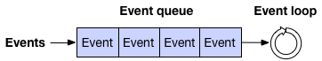
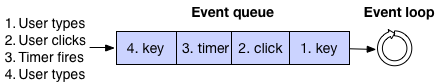
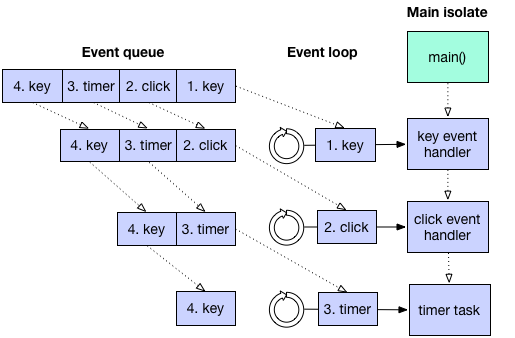
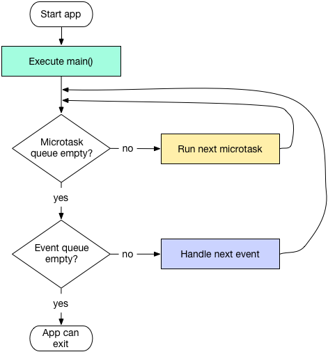

# 事件循环

Async任务在Dart中随处都可以看见，例如非常多的库的方法调用都会返回一个Future对象来实现异步处理，我们也可以注册Handler来响应一些事件，例如：鼠标点击事件、I/O流结束和定时器到期等。      

对写过一些关于UI代码的工程师而言，应该非常熟悉消息循环和消息队列这两个代名词。正是因为有了它们才可以保证UI的绘制操作和一些UI事件，例如鼠标点击事件可以被一个一个的执行从而保证UI和UI事件的统一性。       

<br>

一个消息循环的职责就是不断地从消息队列内取出消息并且处理，直到消息队列为空。        

<div style="text-align: center">

</div>
     
<p style="margin-top: 7px"></p>

消息队列中的消息可能来自于用于的输入，文件I/O消息，定时器等等。例如下图的消息队列就是包含了定时器消息和用户输入消息。     

<div style="text-align: center">

</div>

<p style="margin-top: 7px"></p>

#### 单线程执行

当一个Dart的方法开始执行时，它会一直执行直到这个方法的退出点。或者说，Dart的方法是不会被其它的Dart代码所打断。      

> 这充分说明了Dart代码是单线程执行的（有点类似于NodeJs），当然我们也可以通过创建isolates来实现并行执行的目的。不得不说isolated之间不会共享内存，它们就好像几个运行在不同进程中的app，之间通过传递message来互相通信。除了明确指定运行在额外的isolates或者workers中的代码块外，所有的应用代码都运行在应用的main isolate中。    

正如下图所示，当一个Dart应用开始的标志就是它的main isolate执行了main方法。当main方法退出后，main isolate的线程就会逐一去处理消息队列中的消息。     

<div style="text-align: center">

</div>

<p style="margin-top: 7px"></p>

实际上，上图是经过了简化的流程。     

#### 事件队列

一个Dart应用有一个事件循环（event-loop）和两个事件队列（event和microtask）所组成。    

* event队列：包含所有外来的事件：I/O，mouse events，drawing events，timers，isolate之间的message等
* microtask队列：在Dart中它是必要的，因为有时候事件处理想要在稍后完成一些任务但又希望是在执行下一个事件消息之前

event队列包含Dart和来自系统其它位置的事件。但microtask队列只包含来自于当前isolate的内部代码。      

如下图所示，当main方法退出后，event-loop就开始工作。首先它会采用FIFO的顺序执行microtask，当所有microtask执行完成后它会从event队列中取事件并执行。如此反复进行，直到两个队列都为空为止。       

<div style="text-align: center">

</div>

<p style="margin-top: 7px"></p>

> 要注意一点：当event-loop正在处理microtask事件时，event队列会被阻塞。这时候app就无法进行UI绘制，响应鼠标事件和任何I/O事件等

虽然我们可以预测任务执行的先后顺序，但是却无法准确的预测event-loop何时会处理我们期望的任务。例如当我们创建了一个延时1秒的任务，但是排在我们之前的任务结束前event-loop是不会处理这个延时任务的，也就是说该任务执行可能会大于1秒。        

#### 通过链接方式制定任务顺序

如果我们的代码之间存在依赖，那么尽量让它们之间的依赖关系明确一点。明确的依赖关系可以很好的帮助其他开发人员理解我们的代码，并且可以让我们的代码更加稳定也更加易于重构。      

先来看看下面这段错误代码：      

```dart
// 这样写错误的原因就是没有明确体现出设置变量和使用变量之间的依赖关系
future.then(...set an important variable...);
Timer.run(() {...use the important variable...});
```

正确的写法应该是：     

```dart
// 明确表现出了后者依赖前者设置的变量值
future.then(...set an important variable...)
  .then((_) {...use the important variable...});
```

为了表示明确的前后依赖关系，我们应该使用then()来表明要使用变量就必须要等到设置完这个变量。这里可以使用whenComplete()来代替then，它与then的不通电就在于哪怕设置变量出现了异常也会被调用，这点非常类似于try-catch中的finally。         

如果上面这个使用变量要花费一段时间，那么可以考虑将其放入一个新的Feture中：     

```dart
future.then(...set an important variable...)
  .then((_) {new Future(() {...use the important variable...})});
```

使用一个新的Future可以给event-loop一个机会先去处理队列中的其它事件。         

#### 怎么安排一个任务

当我们需要指定一些代码稍后运行的时候，我们可以使用dart:async提供的两种方式：       

1. Future类：这在上一章中已经说明，它会向event队列的尾部添加一个事件
2. 使用顶级方法scheduleMicotask()，它可以向microtask队列的尾部添加一个微任务

#### 使用合理的队列

我们要记住应该尽量使用Future来向event队列添加事件。使用event队列可以保证microtask队列的简短，以此来减少microtask的过度使用导致event队列的阻塞。       

如果一个任务确实需要在event队列的任何一个事件前去完成，那么我们也应该尽量直接在main方法中去实现而不是使用这两个队列来实现。如果你不能那么做就用scheduleMicrotask来向microtask队列添加一个微任务。        

#### Event队列

使用`new Future`或`new Future.delayed()`来向event队列中添加事件。      

> 注意：你也可以使用Timer来安排任务，但是使用Timer的过程中如果出现异常，则会退出程序。这里推荐使用Future，它是构建在Timer之上并加入了更多的功能，比如检测任务是否完成和异常反馈等。

需要将任务加入event队列可以使用new Future：       

```dart
//向event队列中添加一个任务
new Future(() {
  //任务具体代码
});
```

我们也可以使用then或whenComplete在Future结束后立刻执行某段代码。如下面这段代码在这个Future被执行后立刻输出42：      

```dart
new Future(() => 21)
    .then((v) => v*2)
    .then((v) => print(v));
```

如果需要在一段时间后添加一个任务，可以使用new Future.delayed()：       

```dart
// 一秒以后将任务添加至event队列
new Future.delayed(const Duration(seconds:1), () {
  //任务具体代码
});
```

虽然上面的这个示例中一秒后会向event队列添加一个任务，但是这个任务想要被执行的话必须满足以下几个条件：      

1. main方法执行完毕
2. microtask队列为空
3. 该任务前的任务全部被执行完毕

所以该任务真正被执行可能会大于1秒后。        

关于Future：       

1. 被添加到then()中的方法会在Future执行后立马被执行（但是这个方法并不会被加入到任何队列中，只是被回调）
2. 如果在then()调用之前Future就已经执行完毕，那么会有一个任务被加入到microtask队列中。这个任务执行就是被传入then的方法
3. Future()和Future.delayed()构造方法并不会被立刻完成，它们回向event队列中添加一个任务
4. Future.value()构造方法会在一个microtask中完成
5. Future.sync()构造方法会立马执行其参数方法，并在microtask中完成

#### Microtask队列：scheduleMicrotask()

dart:async定义了一个顶级方法scheduleMicrotask()，我们可以这样来使用：     

```dart
scheduleMicrotask(() {
  // ...code goes here...
});
```

#### 如果有必要可以使用isolate或worker

如果我们想要完成一些重量级的任务，为了保证我们的应用可以响应，我们应该将任务添加到isolate或worker中。isolate可能会运行在不同的进程中。       

一般情况下我们应该使用多少个isolate来完成我们的工作？通常情况下我们可以根据cpu的个数来决定。       

但是我们也可以使用超过cpu个数的isolate，前提就是我们的app能有一个很优秀的架构设计。让不同的isolate来分担不同的代码块运行，但是这前提就是我们保证这些isolate之间没有数据共享。         

#### 试验

在js中Promise和Future是相似的作用，但是js中并没有类似microtask的事件队列，因此这块并不提供js的示例代码。        

##### 示例一：

```dart
import 'dart:async';

main(List<String> args) {
  print('main #1 of 2');
  scheduleMicrotask(() => print('microtask #1 of 2'));

  new Future.delayed(new Duration(seconds: 1), () => print('future #1 (delayed)'));

  new Future(() => print('future #2 of 3'));

  new Future(() => print('future #3 of 3'));

  scheduleMicrotask(() => print('microtask #2 of 2'));
  print('main #2 of 2');
}
```

输出：      

```json
main #1 of 2
main #2 of 2
microtask #1 of 2
microtask #2 of 2
future #2 of 3
future #3 of 3
future #1 (delayed)
```

##### 示例二：

```dart
import 'dart:async';
main() {
  print('main #1 of 2');
  scheduleMicrotask(() => print('microtask #1 of 3'));

  new Future.delayed(new Duration(seconds:1),
      () => print('future #1 (delayed)'));

  new Future(() => print('future #2 of 4'))
      .then((_) => print('future #2a'))
      .then((_) {
        print('future #2b');
        scheduleMicrotask(() => print('microtask #0 (from future #2b)'));
      })
      .then((_) => print('future #2c'));

  scheduleMicrotask(() => print('microtask #2 of 3'));

  new Future(() => print('future #3 of 4'))
      .then((_) => new Future(
                   () => print('future #3a (a new future)')))
      .then((_) => print('future #3b'));

  new Future(() => print('future #4 of 4'));
  scheduleMicrotask(() => print('microtask #3 of 3'));
  print('main #2 of 2');
}
```

输出：      

```json
main #1 of 2
main #2 of 2
microtask #1 of 3
microtask #2 of 3
microtask #3 of 3
future #2 of 4
future #2a
future #2b
future #2c
microtask #0 (from future #2b)
future #3 of 4
future #4 of 4
future #3a (a new future)
future #3b
future #1 (delayed)
```
