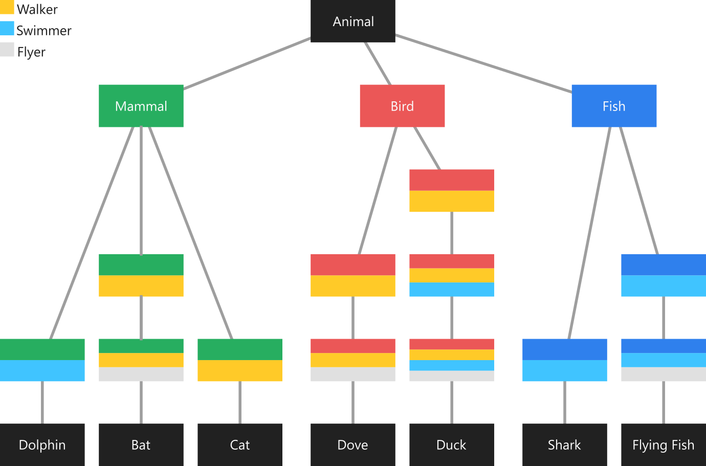

# Mixins

除了传统的面向对象继承方式，mixins是一个强大的概念，它允许我们跨多个类层次结构重用代码，而且这种层次结构支持交叉关系。     

这个概念相对比较难以理解，我们来看一个示例。我们这里有一个名为Animal的父类，它有三个子类（Mammal，Bird和Fish）。在底部，我们有具体的一些子类，每个子类具有不同的行为。例如有些动物有共同的行为：猫（Cat）和鸽子（Dove）都可以行走，但是猫不能飞。这些行为与此分类正交，因此我们无法在父类中实现这些行为。      

如果一个类可以拥有多个父类，那就很容易办到。我们可以创建另外三个类：Walker，Swimmer，Flyer。在那之后，我们只需让Cat继承Walker，Dove继承Walker和Flyer即可。但在Dart中，每个类（除了Object类）都只能有一个父类。    

<br>



<br>

我们需要一种在多个类层次结构中重用类的代码的方法。Mixins就能够办到这一点！   

<!--sec data-title="Dart" data-id="section1" data-show=true ces-->
```dart
// 动物
abstract class Animal {}
// 哺乳动物
abstract class Mammal extends Animal {}
// 鸟类
abstract class Bird extends Animal {}
// 鱼类
abstract class Fish extends Animal {}
// 跑的行为类
abstract class Walker {
  factory Walker._() => null;

  void walk() {
    print('I am walking');
  }
}
// 游的行为类
abstract class Swimmer {
  factory Swimmer._() => null;

  void swim() {
    print('I am swimming');
  }
}
// 飞的行为类
abstract class Flyer {
  factory Flyer._() => null;

  void fly() {
    print('I am flying');
  }
}

// 海豚
class Dolphin extends Mammal with Swimmer {}
// 蝙蝠
class Bat extends Mammal with Walker, Flyer {}
// 猫
class Cat extends Mammal with Walker {}
// 鸽子
class Dove extends Bird with Walker, Flyer {}
// 鸭子
class Duck extends Bird with Walker, Swimmer, Flyer {}
// 鲨鱼
class Shark extends Fish with Swimmer {}
// 文鳐鱼
class FlyingFish extends Fish with Swimmer, Flyer {}

main(List<String> args) {
  Cat cat = Cat();
  cat.walk();

  Bat bat = Bat();
  bat.walk();
  bat.fly();
}
```
<!--endsec-->

<!--sec data-title="TypeScript" data-id="section2" data-show=true data-collapse=false ces-->
```javascript
// 动物超类
abstract class Animal {}
// 哺乳动物超类
abstract class Mammal extends Animal {}
// 鸟类超类
abstract class Bird extends Animal {}
// 鱼类超类
abstract class Fish extends Animal {}
// 跑的混入类
abstract class  Walker {
  walk(): void {
    console.log('I am walking')
  }
}
// 游的混入类
abstract class  Swimmer {
  swim(): void {
    console.log('I am swimming')
  }
}
// 飞的混入类
abstract class  Flyer {
  fly(): void {
    console.log('I am flying')
  }
}

// 修饰器注入混入
function mixins(mixinObjs: any[]) {
  // TS通过帮助函数实现混入操作
  const applyMixins = (derivedCtor: any, baseCtors: any[]) => 
    baseCtors.forEach(baseCtor => {
      Object.getOwnPropertyNames(baseCtor.prototype).forEach(name => {
        derivedCtor.prototype[name] = baseCtor.prototype[name]
      })
    })
  return function(target) {
    applyMixins(target, mixinObjs)
  }
}

// 海豚
@mixins([Swimmer])
class Dolphin extends Mammal implements Swimmer {
  swim: () => void
}
// 蝙蝠
@mixins([Walker, Flyer])
class Bat extends Mammal implements Walker, Flyer {
  walk: () => void
  fly: () => void
}
// 猫
@mixins([Walker])
class Cat extends Mammal implements Walker {
  walk: () => void
}
// 鸽子
@mixins([Walker, Flyer])
class Dove extends Bird implements Walker, Flyer {
  walk: () => void
  fly: () => void
}
// 鸭子
@mixins([Walker, Swimmer, Flyer])
class Duck extends Bird implements Walker, Swimmer, Flyer {
  walk: () => void
  swim: () => void
  fly: () => void
}
// 鲨鱼
@mixins([Swimmer])
class Shark extends Fish implements Swimmer {
  swim: () => void
}
// 文鳐鱼
@mixins([Swimmer, Flyer])
class FlyingFish extends Fish implements Swimmer, Flyer {
  swim: () => void
  fly: () => void
}

const cat = new Cat()
cat.walk()

const bat = new Bat()
bat.walk()
bat.fly()
```
<!--endsec-->

##### 语法

我们明白了Mixins为什么如此有用，下面让我们看看如何创建和使用它们。     

Mixins通过普通的类声明隐式定义：      

```dart
class Walker {
  void walk() {
    print("I am walking");
  }
}
```

如果我们不想让我们创建的Mixins被实例化或者再扩展，我们可以把它定义为：     

```dart
abstract class Walker {
  factory Walker._() => null;

  void walk() {
    print("I'm walking");
  }
}
```

要使用Mixins的话，需要使用with关键字，后跟一个或多个Mixin的名称：     

```dart
class Cat extends Mammal with Walker {}

class Bat extends Mammal with Walker, Flyer {}
```

我们在Cat类上定义了Walker mixin，它允许我们调用walk()方法而不是fly()方法；但我们的Bat类却既可以调用walk()方法也可以调用fly()方法。虽然他们都是继承Mammal父类，但是我们并不能在Mammal父类去实现这2个方法，因为它们并不存在共性。      

```dart
main(List<String> args) {
  Cat cat = Cat();
  cat.walk();
  // cat.fly();  // NoSuchMethod

  Bat bat = Bat();
  bat.walk();
  bat.fly();
}
```

##### 趋势

Mixins在Dart中发展的非常快，以致于我们可以通过继承的方式来约束Mixins，看下面这段代码的实现：     

```dart
abstract class Super {
  void method() {
    print('Super');
  }
}

class MySuper implements Super {
  @override
  void method() {
    print('MySuper');
  }
}

mixin Mixin on Super {
  void method() {
    super.method();
    print('Sub');
  }
}

class Client extends MySuper with Mixin {

}

main(List<String> args) {
  Client().method();
}
```

输出：     

```javascript
MySuper
Sub
```

从上面可以看出，我们可以使用mixin关键字来定义个mixin object，同时通过on关键字来继承一个Super超类，此时该mixin就已经被Super超类所约束。这意味着之后在使用mixin时，混入mixin的类必须继承或实现Super，因为mixin中使用了Super.提供的功能。     
